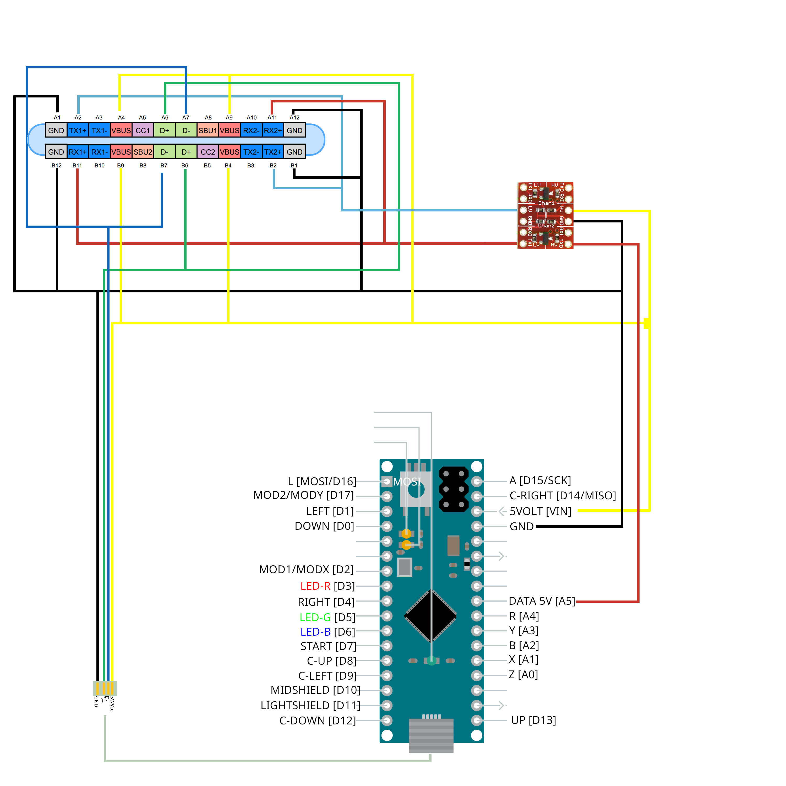

# BerlinSmashB0XX
creating an B0XX style Computer for GameCube/Wii/Switch/PC. It uses a modified Version of the Arduino Software by Crane.
## Sheets Table with needed stuff (what I used)
[Link](https://docs.google.com/spreadsheets/d/1eOKCmWyHzAshiUkLt0JzJ1KQH1quyB1J7RihwCuCdhg/edit?usp=sharing)
## Wiring:

## Support:
If You need support go to Crane's [Discord](discord.gg/P2BxMVY) Link
